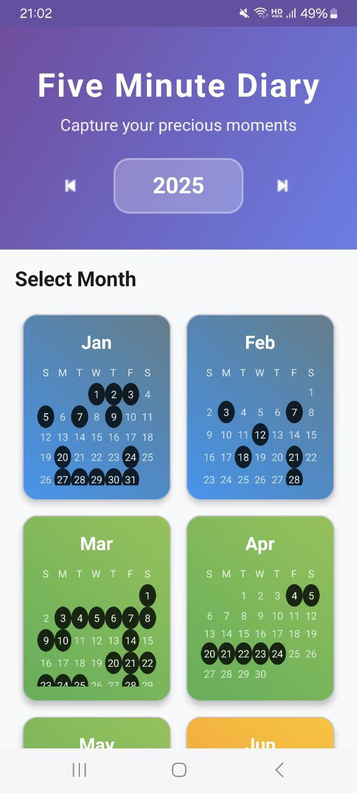
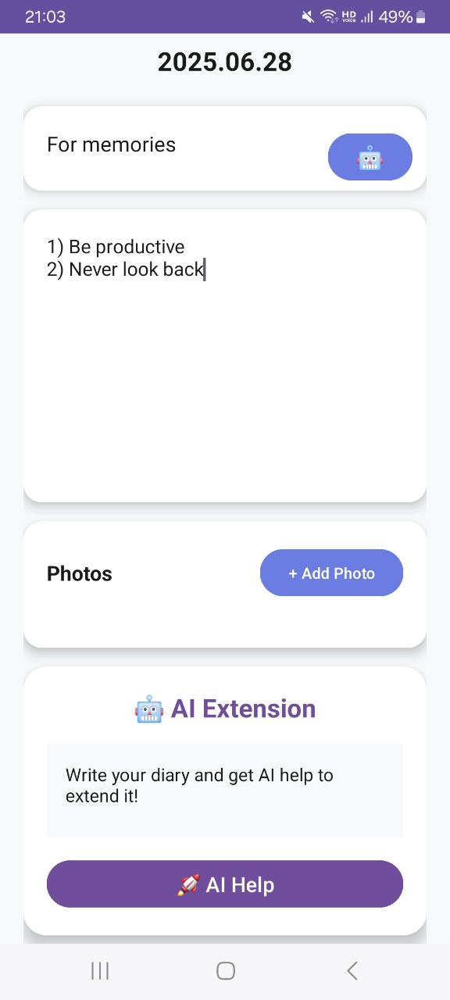

# Five Minute Diary

A simple and intuitive digital diary application that encourages daily reflection through quick 5-minute journal entries. This project helps users maintain a consistent journaling habit by keeping entries brief and focused.

## Screenshots

### Main Dashboard

*The clean and intuitive main interface for daily journaling*

### Daily Entry Form

*Simple form designed for quick 5-minute journal entries*

### Additional Screenshots
*More screenshots will be added as the application develops*

## Features

- **Quick Entries**: Designed for 5-minute daily journal sessions
- **User-Friendly Interface**: Clean and minimalist design for distraction-free writing
- **Daily Prompts**: Guided questions to inspire reflection
- **Entry Management**: View, edit, and organize your diary entries
- **Search Functionality**: Find specific entries by date or content
- **Responsive Design**: Works seamlessly on desktop and mobile devices

## Technologies Used

- Frontend: HTML5, CSS3, JavaScript
- Backend: [Add your backend technology]
- Database: [Add your database choice]
- Version Control: Git

## Usage

1. **Create an Account**: Sign up to start your journaling journey
2. **Daily Entry**: Set aside 5 minutes each day to write your thoughts
3. **Use Prompts**: Follow the guided questions for structured reflection
4. **Review Past Entries**: Browse your journal history to track personal growth
5. **Search**: Use the search feature to find specific memories or thoughts

## Project Structure

```
gyuun-Fiveminiutediary/
├── src/
│   ├── components/
│   ├── pages/
│   ├── styles/
│   └── utils/
├── public/
├── docs/
└── README.md
```

## Contributing

1. Fork the repository
2. Create a feature branch (`git checkout -b feature/new-feature`)
3. Commit your changes (`git commit -m 'Add new feature'`)
4. Push to the branch (`git push origin feature/new-feature`)
5. Open a Pull Request

## Development Guidelines

- Follow consistent code formatting
- Write meaningful commit messages
- Add comments for complex functionality
- Test your changes before submitting

## Future Enhancements

- [ ] Mobile app development
- [ ] Cloud synchronization
- [ ] Mood tracking integration
- [ ] Export functionality
- [ ] Multiple language support

## License

This project is part of the Software Design & Lab course at PNU (7th semester).

## Contact

For questions or suggestions, please reach out through the course communication channels.

---

*"The secret of getting ahead is getting started. The secret of getting started is breaking your complex overwhelming tasks into small manageable tasks, and starting on the first one."* - Mark Twain
